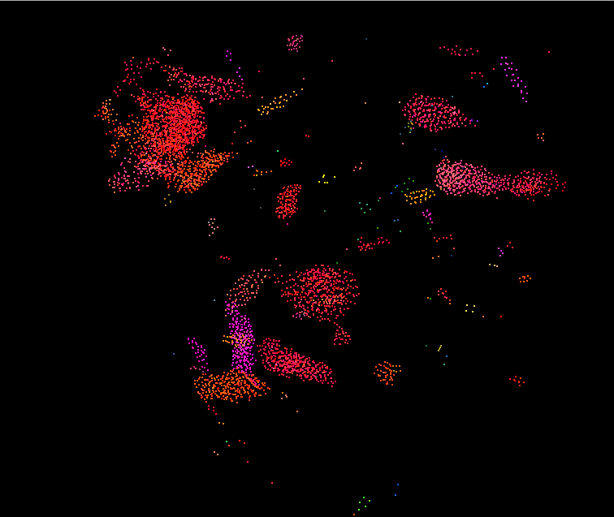
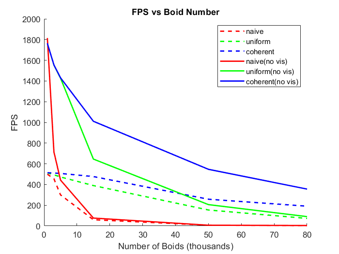
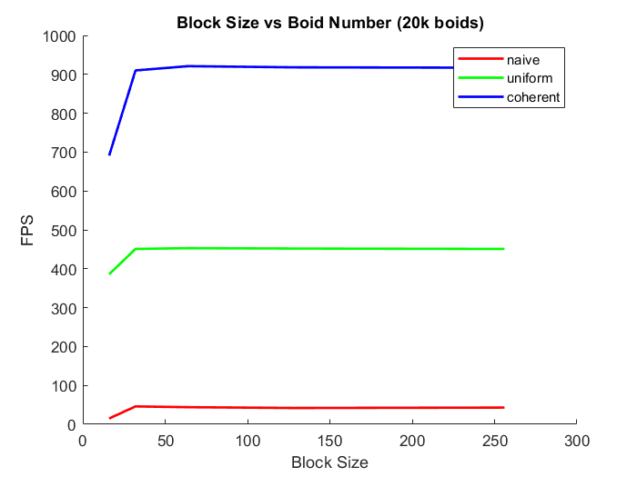

# Project 1 - Flocking Simulation

**University of Pennsylvania, CIS 565: GPU Programming and Architecture,
Project 1 - Flocking**

* Weiqi Chen
  * [LinkedIn](https://www.linkedin.com/in/weiqi-ricky-chen-2b04b2ab/)
* Tested on: Windows 10, i7-8750H @ 2.20GHz 2.21GHz, 16GB, GTX 1050 2GB

## Screenshots
| 5,000 Boids | 100,000 Boids |
|--|--|
| |  |

## Performance Analysis
### 1. Number of Boids
The plot shows the FPS vs Boid Size for the 3 implementations.

* As the number of boids increases, performance decreases for all implementations.
* Coherent grid has the best performance with large number of boids.
* Visualization decreases performance.
* The improvement from uniform grid to coherent uniform grid is more obvious as the number of boids increases.
* The naive method is only good with a small number of boids.

For each boid, naive method requires us to check every other boid, while uniform grid methods only need to check some/all of a boid's neighboring cells. Therefore computation
time is decreased.

### 2. Block Size

The plot below shows the FPS vs block size and visualization is turned off.
* Performance is increased significantly when block size is increased from 16 to 32.
* From block size 32 to 256, the performance is similar.
Since the warp size is 32, a block size of less than 32 will lead to inactive threads in a warp. When block size is greater than 32, all threads will be used for parallel computation.

### 3. Coherent Uniform Grid
Coherent uniform grid has better performance than uniform grid. The more boids there are, the greater the difference. This is because:
* We reorder `dev_pos` and `dev_vel` and boids in the same cell now occupy contiguous memory.

* `dev_particleArrayIndices` in the global memory is accessed one time less, resulting in 1 level decrease of indirection.

### 4. Cell Width
Half cell width increases the performance due to decrease in computation. Assuming a neighborhood distance of 1:
* For full cell width, 2, need to check a volume of 43 = 64
* For half cell width, 1, need to check a volume of 33 = 27

Using the coherent uniform grid implementation, we have:

||Full Width (8 cells)| Half Width (27 cells)
|--|--|--|
|5k Boids|1431 FPS|1521 FPS|
|15k Boids|1011 FPS | 1132FPS|
|50k Boids|547 FPS |556 FPS|
